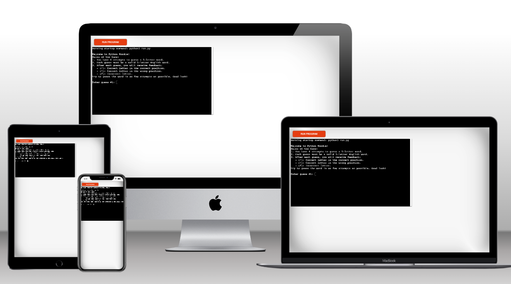

# Python Wordle Project



## Introduction
This project represents my third portfolio project as a Full-Stack Software Development student at the Code Institute. My journey to this particular project began with a phase of research and inspiration-seeking on YouTube. It was there that I stumbled upon the fascinating concept of the Wordle game. Intrigued by its simplicity and challenge, I decided to implement my own version of it.

The specific inspiration for this project came from a YouTube video, which can be found [here](https://www.youtube.com/watch?v=GPekrrKcymA). This video provided a foundation, but I aimed to add my unique touch. Before diving into coding, I spent time on Miro, a collaborative visual platform, to brainstorm and visualize my ideas. This pre-coding phase was crucial as it allowed me to lay out a clear plan and structure for the implementation.

After this careful planning, I transformed these visualized concepts into code, making several modifications to the original idea to better fit my vision. These alterations were not just in terms of functionality but also in making the code more efficient and user-friendly. This project not only served as a significant learning experience but also as a testament to my growth and skills as a budding Full-Stack Developer. Miro board can be found [here](https://miro.com/app/board/uXjVNNiPdoY=/?share_link_id=329398393965)

[Here is the live version of my project.](https://pythonwordle-abbb4f5d58ef.herokuapp.com/)

## Project Overview
The Python Wordle Project is an implementation of the popular word-guessing game Wordle in Python. It aims to provide users with a fun and interactive gameplay experience where they guess a randomly selected 5-letter word within six attempts.

## Game Rules
- Players have 6 attempts to guess the word.
- Each guess must be a valid English word with 5 letters.
- Feedback for each guess:
  - ✓: Correct letter in the correct position
  - ?: Correct letter in the wrong position
  - ✗: Incorrect letter
- The game ends if the word is not guessed within 6 attempts.

## Setup
Ensure the `valid_words.txt` and `answer_words.txt` files are in the same directory as `main.py`.

## Dependencies
- Python 3.x

## Key Code Functions

### `display_welcome_message()`
This function displays a welcome message at the beginning of the game. It explains the rules of Wordle, making sure players understand how to play before they start guessing. The message includes:
- The number of attempts players have (6 attempts).
- The requirement for the guess (a valid 5-letter English word).
- The feedback system for each guess:
  - (✓): Correct letter in the correct position.
  - (?): Correct letter in the wrong position.
  - (✗): Incorrect letter.

### Example Usage
```python
def main():
    valid_words = load_dictionary("valid_words.txt")
    answer_words = load_dictionary("answer_words.txt")
    if valid_words and answer_words:
        display_welcome_message()  # Display the welcome message
        play_wordle(valid_words, answer_words)
    else:
        print("Game cannot start without word lists.")
```

### `load_dictionary(file_path)`
This function loads a list of words from a specified text file. It handles file-not-found errors and cases where the file is empty, returning an empty list in such cases. This function is crucial for reading both `valid_words.txt` and `answer_words.txt`.

```python
def load_dictionary(file_path):
    try:
        with open(file_path, 'r') as file:
            words = [line.strip().lower() for line in file if line.strip()]
        return words
    except FileNotFoundError:
        print(f"Error: The file {file_path} was not found.")
        return []
```

### `is_valid_guess(guess, valid_words)`
This function checks if the player's guess is valid. A valid guess is a five-letter alphabetical word that exists in the list of valid words.

```python
def is_valid_guess(guess, valid_words):
    return guess.isalpha() and len(guess) == 5 and guess in valid_words
```
### `evaluate_guess(guess, secret_word)`
This function evaluates the player's guess against the secret word, providing letter-by-letter feedback. It indicates whether each letter in the guess is correct and in the right position, correct but in the wrong position, or not in the word at all.

```python
def evaluate_guess(guess, secret_word):
    feedback = []
    for i in range(5):
        if guess[i] == secret_word[i]:
            feedback.append(f"(✓){guess[i]}")
        elif guess[i] in secret_word:
            feedback.append(f"(?) {guess[i]}")
        else:
            feedback.append(f"(✗) {guess[i]}")
    return ' '.join(feedback)
```
### `play_wordle(valid_words, answer_words)`
The main game loop. It randomly selects a secret word and processes player inputs, providing feedback and checking for the end of the game.

```python
def play_wordle(valid_words, answer_words):
    secret_word = random.choice(answer_words)
    attempts = 0
    while attempts < 6:
        guess = input(f"Enter guess #{attempts+1}: ").lower()
        if not is_valid_guess(guess, valid_words):
            print("Invalid guess. Try a different 5-letter word.")
            continue
        print(evaluate_guess(guess, secret_word))
        if guess == secret_word:
            print("Congratulations! You've guessed the word correctly!")
            break
        attempts += 1
    if attempts == 6:
        print(f"Game Over. The secret word was: {secret_word}")
    if input("Play again? (y/n): ").lower() == 'y':
        play_wordle(valid_words, answer_words)
```
### `main()`
The main function that loads the word lists and initiates the game if the lists are present. This function serves as the entry point of the game.

```python
def main():
    valid_words = load_dictionary("valid_words.txt")
    answer_words = load_dictionary("answer_words.txt")
    if valid_words and answer_words:
        play_wordle(valid_words, answer_words)
    else:
        print("Game cannot start without word lists.")
```

# Data Model

## Overview
The Python Wordle game utilizes a simple yet effective data model to facilitate the gameplay. The data model primarily revolves around the management of word lists and the tracking of game state.

### Word Lists
The game uses two main types of word lists:
- **Valid Words (`valid_words.txt`)**: This list contains a comprehensive collection of valid 5-letter English words. It is used to validate the player's guesses.
- **Answer Words (`answer_words.txt`)**: A subset of the valid words, this list contains the words that can be chosen as the secret word for each game.

These lists are loaded into the game using the `load_dictionary(file_path)` function, which reads the words from text files and stores them in Python lists for easy access during gameplay.

### Game State
The game state is managed within the `play_wordle(valid_words, answer_words)` function and includes the following key elements:
- **Secret Word**: A randomly selected word from the answer words list, which players try to guess.
- **Attempts**: The number of guesses made by the player (limited to 6).
- **Guess Validation**: Each guess is validated against the valid words list using the `is_valid_guess(guess, valid_words)` function.
- **Feedback**: After each guess, feedback is provided to the player using the `evaluate_guess(guess, secret_word)` function, indicating the accuracy of each letter in the guess.

### Player Interaction
Player interaction is handled through the console, where players input their guesses. The game provides real-time feedback and guides the player through the guessing process.

## Implementation
The data model is implemented in Python, leveraging basic data structures like lists for storing and managing words. The simplicity of the model ensures fast and efficient gameplay, making the game suitable for running in a command-line interface.

This straightforward approach to data modeling aligns well with the nature of the game, emphasizing functionality and player experience.

# Testing

## Overview
Thorough testing has been conducted to ensure the reliability and efficiency of the Python Wordle game. The primary focus was on code quality and adherence to coding standards, especially those outlined in PEP 8, the Python style guide.

### CI Python Linter
To maintain high-quality code, the project was rigorously tested using the [CI Python Linter](https://pep8ci.herokuapp.com/). This tool was instrumental in ensuring that the code adheres to the conventions and style guidelines of PEP 8.

#### Process
- The source code was submitted to the CI Python Linter.
- The linter analyzed the code for any issues that deviate from PEP 8 standards.
- Each issue was meticulously reviewed and resolved to ensure compliance with PEP 8 guidelines.

### Benefits
Using the CI Python Linter provided several benefits:
- **Code Quality**: Improved the overall quality of the codebase, making it more readable and maintainable.
- **Consistency**: Ensured consistent coding style throughout the project.
- **Best Practices**: Encouraged the use of Python best practices, enhancing the robustness of the application.

## Manual Testing
In addition to automated linting, manual testing was performed to cover various aspects of the game:
- **Functionality**: Each function, including word loading, input validation, and feedback generation, was tested to ensure correct operation.
- **Game Logic**: The game logic was tested to confirm that the game follows the intended flow and rules.
- **User Interaction**: The game's response to different types of user input (valid/invalid guesses) was thoroughly tested.

### Test Cases
Example test cases included:
- Entering valid and invalid guesses.
- Guessing the secret word within the allowed attempts.
- Exceeding the maximum number of attempts without guessing the word.
- Testing edge cases and unusual input scenarios.

Through this comprehensive testing approach, both through the CI Python Linter and manual testing, the Python Wordle game has been refined to provide an engaging and error-free user experience.

# Bugs and Fixes

## Overview
During the development of the Python Wordle game, several bugs were encountered and subsequently addressed. This section documents some of these challenges and their resolutions, highlighting the continuous improvement of the game.

### Encountered Bugs

#### 1. Invalid Input Acceptance
**Problem**: The game initially accepted inputs that were either not five letters long or not valid English words.
**Solution**: Strengthened the validation in the `is_valid_guess` function to ensure that all inputs are exactly five letters and are contained in the list of valid words.
```python
# Improved is_valid_guess function
def is_valid_guess(guess, valid_words):
    return guess.isalpha() and len(guess) == 5 and guess in valid_words
```
#### 2. Incorrect Feedback for Repeated Letters
**Problem**: The feedback system was providing inconsistent results when the secret word contained repeated letters.
**Solution**: Adjusted the evaluate_guess function to handle repeated letters more accurately and ensure correct feedback.
```python
# Adjusted evaluate_guess function
def evaluate_guess(guess, secret_word):
    feedback = []
    for i in range(5):
        if guess[i] == secret_word[i]:
            feedback.append(f"(✓){guess[i]}")
        else:
            feedback.append(f"(✗) {guess[i]}" if guess[i] not in secret_word else f"(?) {guess[i]}")
    return ' '.join(feedback)
```
#### 3. Game Crash on Missing Word Lists
**Problem**: The game was crashing when the word list files were missing or not loaded correctly.
**Solution**: Implemented an error check in the load_dictionary function to safely terminate the game and display a clear error message if files are missing or unreadable.
```python
# Error handling in load_dictionary
def load_dictionary(file_path):
    try:
        with open(file_path, 'r') as file:
            words = [line.strip().lower() for line in file if line.strip()]
        return words
    except FileNotFoundError:
        print(f"Error: The file {file_path} was not found.")
        return []
```

# Deployment

## Heroku Deployment
This Python Wordle game is deployed on Heroku, making it accessible to anyone with an internet connection. Deploying on Heroku offers a simple and effective way to host Python applications and make them available to a wide audience.

### Accessing the Game
To play the game, simply click on the following link: [Play Python Wordle on Heroku](https://pythonwordle-abbb4f5d58ef.herokuapp.com/)

This link will take you directly to the game hosted on Heroku. There's no need to install anything; just click the link and start playing!

### How It's Deployed
The game was deployed on Heroku by following these steps:
1. Create a `requirements.txt` to specify the Python dependencies and entry point for the application.
2. Set up a Heroku app through the Heroku dashboard or Heroku CLI.
3. Link the Heroku app to the GitHub repository containing the project.
4. Deploy the application directly from the repository.

Heroku automatically detects the necessary buildpacks and environment settings to host the Python application. Once deployed, the application is accessible via the provided URL.

### Installation
Clone the repository or download the files and store them in your preferred directory.

### Starting the Game
Run main.py from your Python interpreter to start the game.

# Acknowledgements

I would like to extend my heartfelt gratitude to several individuals and groups who played a pivotal role in the realization of this project.

Firstly, a special thanks to the YouTube channel [Code Entropy](https://www.youtube.com/@Code_Entropy) for being a source of inspiration and providing valuable code snippets that greatly influenced my approach to this project. The insights and ideas presented on this channel were instrumental in shaping the development of this Python Wordle game.

I also want to express my sincere appreciation to everyone at the Code Institute. The unwavering support and guidance from the faculty and staff have been remarkable. Their expertise and encouragement have been crucial in my journey as a Full-Stack Software Development student and have significantly contributed to my growth and learning.

Lastly, but certainly not least, I owe a profound thank you to my family. Your support and belief in my dreams have made all of this possible. Your constant encouragement and faith in my abilities have been a source of strength and motivation. I am grateful for your endless love and support.

This project is not just a reflection of my hard work but also a testament to the support and inspiration provided by each one of you.

Thank you.

Nelson Mehlis
